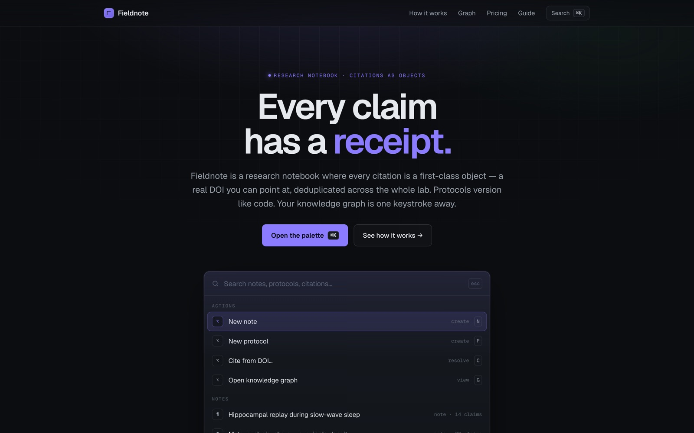

<!-- parable:beautified -->
<div align="center">

<h1>Fieldnote</h1>

<p><strong>Research notes with citations — a working ⌘K palette + hover-cards.</strong></p>

<p>
  <a href="https://bswxyz.github.io/fieldnote-research/"></a>
  
  
  <a href="LICENSE"></a>
</p>

<p>
  <a href="https://bswxyz.github.io/fieldnote-research/"><b>Live demo</b></a>
  &nbsp;·&nbsp;
  <a href="https://bswxyz.github.io/fieldnote-research/guide/">Build notes</a>
  &nbsp;·&nbsp;
  <a href="https://parable-three.vercel.app/templates">More templates</a>
</p>

<a href="https://bswxyz.github.io/fieldnote-research/">
  
</a>

</div>

**Use this template** — copy the source into a new project:

```bash
npx degit bswxyz/fieldnote-research my-app
```


A research-notebook landing site for scientists and academics, built around a working ⌘K command
palette and citations as first-class objects — part of the
[Parable 25 design showcase](https://parable-three.vercel.app).

---

## The concept

Scientists don't lose their data — they lose the *why*. Which paper backed this claim? Which version
of the protocol produced that figure? Fieldnote's pitch is that a citation should be a **first-class
object**: one canonical, resolvable DOI, deduplicated across the whole lab, attached to the exact
sentence it supports. Protocols version like code. The lab's knowledge is a single searchable graph.

The site sells that in five seconds by making the **hero itself the product**: a real command palette
you can type into, fuzzy-searching fictional notes, protocols, and citations. Scroll on and it proves
the claim — a note whose citations pop a source card, a backlinks rail, an SVG knowledge graph that
lights up. It's positioned as a precise, quietly-confident dev tool (supermemory / greptile grammar),
not a consumer note app.

## Design system

- **Palette (dev-tool dark):**
  `--bg:#0b0d10` near-black · `--panel:#12151a` raised surface · `--ink:#e6e9ee` · `--dim:#9aa3ad` ·
  `--faint:#566069` · `--violet:#8b7cff` (single accent) · `--green:#57d99a` (terminal/success) ·
  `--line:rgba(230,233,238,.09)`. Violet carries interaction; green marks the "resolved / verified"
  state and the mono `§` bullets.
- **Type — Geist / Geist / Geist Mono.** One family across display, body, and mono. The restraint *is*
  the identity: a dev tool speaks in one confident, tabular voice. Tabular numerals on every metric,
  DOI, and result count.
- **Signature motion:** a long expo-out `cubic-bezier(.2,.9,.1,1)` used everywhere for a precise
  settle; a clipped-line hero intro; a command-palette pop with a slight overshoot; graph nodes that
  light up in sequence; a marquee ticker.
- **Why these fit:** research tooling is about precision and trust, so the identity is monochrome with
  a single accent, a fine dotted grid, and instrumentation-style mono labels — nothing decorative
  competes with the content.

## Stack

- **Next.js (App Router) + `output: 'export'`.** Pre-renders to static HTML/CSS/JS — no server, no
  database. React earns its place because the palette, citation cards, graph, and counters are
  genuinely stateful; a vanilla build would reinvent a component framework.
- **Zero runtime backend.** The "search index" is a hand-authored fixture plus an in-memory
  subsequence fuzzy-matcher (~40 lines) that also returns matched indices for highlighting.
- **No images.** Every visual is typographic, CSS, or SVG (the knowledge graph, the citation cards,
  the editor mock).
- Deployed to GitHub Pages from `/docs` with `basePath`/`assetPrefix` set to `/fieldnote-research`.

## Running it locally

```bash
git clone https://github.com/bswxyz/fieldnote-research
cd fieldnote-research
npm install
npm run dev        # http://localhost:3000/fieldnote-research
# or a production static build:
npm run build      # writes ./out (and touches out/.nojekyll)
```

The published site is the static export copied into `./docs`.

## Structure

```
app/layout.tsx        <html>, fonts, metadata, the .js progressive-enhancement gate, palette provider
app/page.tsx          section assembly (server component; metadata lives here)
app/globals.css       all styling — design tokens in :root at the very top
app/guide/page.tsx    the "how it was built" write-up, styled to match
components/            PaletteBody, PaletteProvider (⌘K + overlay), Hero, Steps (+ note/editor mocks),
                       CitationChip, Graph, Ticker, Stats, Pricing, CTA, Nav, Reveal
lib/data.ts           the fictional corpus: notes, protocols, citations, sources, graph, tiers, stats
lib/search.ts         fuzzy matcher + grouped, best-match-first ranking
lib/hooks.ts          reduced-motion, in-view, count-up, focus-trap, meta-key
docs/                 the static export served by GitHub Pages (.nojekyll included)
next.config.mjs       output:'export', basePath, assetPrefix, trailingSlash, images.unoptimized
```

## Demo vs. real — what a production version would need

This is an intentionally-scoped demo. What's **mocked / fictional** today:

- **The notes, protocols, labs, and citations are invented.** The three DOI hover-cards resolve to real
  landmark papers for flavour, but nothing is fetched — there is no CrossRef/DOI resolver.
- **Search runs in memory.** A subsequence fuzzy-matcher over ~20 fixtures. A real product needs a
  document store and an actual index (Tantivy / Meilisearch, or embeddings for semantic search) — the
  "~7 ms" latency stat is aspirational copy, not a measurement.
- **The knowledge graph is hand-placed.** Node positions and edges are authored, not computed from a
  real link structure or a force simulation.
- **No accounts, sync, collaboration, or storage.** A real Fieldnote needs auth, per-lab access
  control, CRDT collaboration, versioned protocol storage, and ORCID / repository integrations.
- **The counters and pricing** are illustrative; there is no billing.

What's **real** and reusable as-is: the entire ⌘K command palette (inline + focus-trapped overlay,
full keyboard model, fuzzy highlighting, grouped best-match ranking), the citation hover-card +
backlinks interaction, the SVG knowledge graph, the STEP scroll with sticky rail, the animated
counters, and the whole responsive / reduced-motion / keyboard-accessible layer.

## License

[MIT](LICENSE). Design & build by **Parable**. No third-party assets — every visual
is code.
